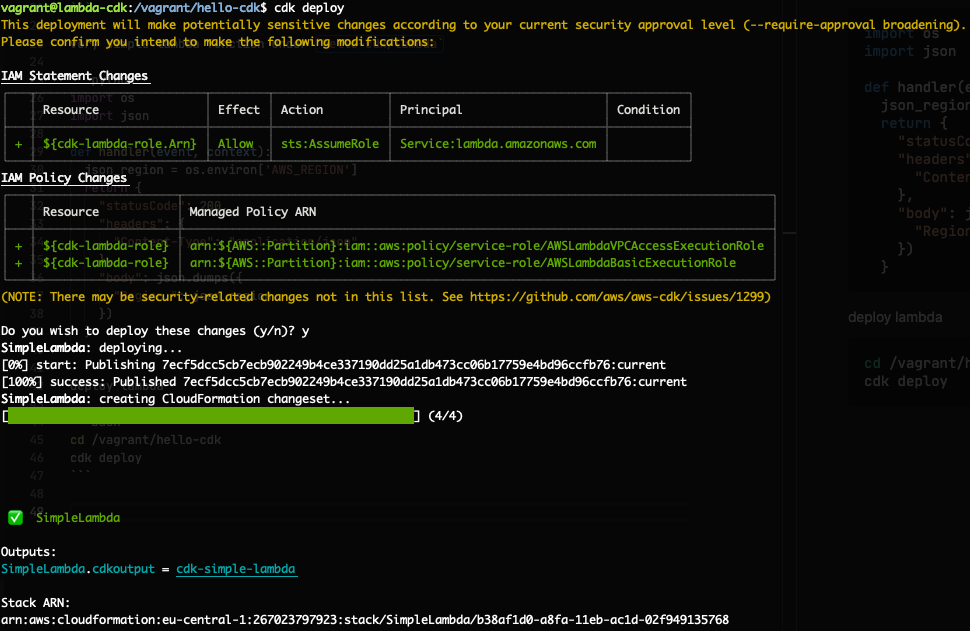
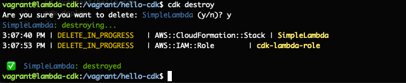

# lambda-cdk
Deploy AWS lambda using AWS CDK.


## Pre-requirements
- AWS account
- vagrant for development environment

## How to use

```bash
vagrant up --provider virtualbox
```
## In case of new project

- create project directory
- initiate the project with supported language of choice (python in my case)

```bash
mkdir hello-cdk
cd hello-cdk
cdk init app --language python
```

very simple lambda function under `hello-cdk/lambda`

```python
import os
import json
        
def handler(event, context):
  json_region = os.environ['AWS_REGION']
  return {
    "statusCode": 200,
    "headers": {
      "Content-Type": "application/json"
    },
    "body": json.dumps({
      "Region ": json_region
    })
  }
```

**deploy lambda**

```bash
cd /vagrant/hello-cdk
cdk deploy
```



**destroy lambda**

```bash
cdk destroy
```

